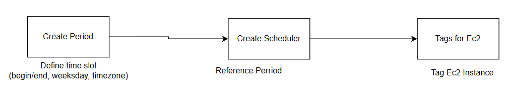

# AWS Instance Scheduler Configuration

## Overview
AWS Instance Scheduler is a solution that allows you to automate the start and stop times of your EC2 instances using schedules and periods.

### What is a Period?
A period defines a specific time range within which instances should start/stop. It includes attributes:
- `begintime`: The start time (e.g., `09:00`)
- `endtime`: The end time (e.g., `18:00`)
- `weekdays`: The days of the week when the period applies (e.g., `mon-fri`)
- `timezone`: The timezone in which the period is defined

### What is a Schedule?
A schedule is a set of one or more periods. It associates specific periods with EC2 instances using tags.
- A schedule can reference one or more periods
- The schedule's timezone should match the required execution region

---
## Pipeline Architect

---
## Step 1: Create a Period using AWS CLI
To create a new period name `custom-hours`, 

Change `table-name` with name of table in dynamoDB

```sh
aws dynamodb put-item \
    --table-name "instance-scheduler-ConfigTable-1UEPV1KC8ZETH" \
    --item '{
        "type": {"S": "period"},
        "name": {"S": "custom-hours"},
        "begintime": {"S": "09:00"},
        "description": {"S": "Custom working hours"},
        "endtime": {"S": "18:00"},
        "weekdays": {"SS": ["mon", "tue", "wed", "thu", "fri"]}
    }' \
    --region us-east-1
```

---

## Step 2: Create a Schedule using AWS CLI
To create a schedule that **references** the `custom-hours` period, use:


```sh
aws dynamodb put-item \
    --table-name "instance-scheduler-ConfigTable-1UEPV1KC8ZETH" \
    --item '{
        "type": {"S": "schedule"},
        "name": {"S": "custom-schedule"},
        "description": {"S": "Custom schedule using custom-hours period"},
        "periods": {"SS": ["custom-hours"]},
        "timezone": {"S": "Asia/Ho_Chi_Minh"}
    }' \
    --region us-east-1
```

---

## Step 3: Assign Schedule to EC2 Instances

### Attach Schedule to a Single EC2 Instance
```sh
aws ec2 create-tags \
    --resources <INSTANCE_ID> \
    --tags Key=Schedule,Value="custom-schedule" \
    --region us-east-1
```