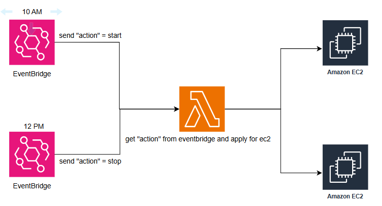

# AWS Instance Scheduler Configuration

## Overview
AWS Instance Scheduler is a solution that allows you to automate the start and stop times of your EC2 instances using schedules and periods.

### Learn More
For more detailed [AWS Instance Scheduler](https://docs.aws.amazon.com/solutions/latest/instance-scheduler-on-aws/scheduler-cli-4.html).
### What is a Period?
A period defines a specific time range within which instances should start/stop. It includes attributes:
- `begintime`: The start time (e.g., `10:00`)
- `endtime`: The end time (e.g., `23:59`)
- `weekdays`: The days of the week when the period applies (e.g., `mon-fri`)
- `timezone`: The timezone in which the period is defined

### What is a Schedule?
A schedule is a set of one or more periods. It associates specific periods with EC2 instances using tags.
- A schedule can reference one or more periods
- The schedule's timezone should match the required execution region

---
## Pipeline Architect

---
## Step 1: Create a Period using Scheduler CLI
To create a new period name `custom-hours`, 

Create new Period with begintime at 10am and endtime at 23h59pm. 
Change `table-name` with name of table in dynamoDB
